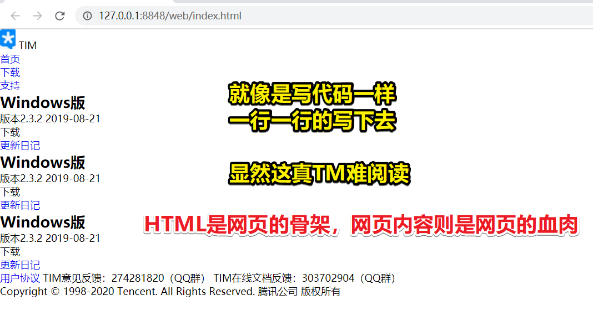
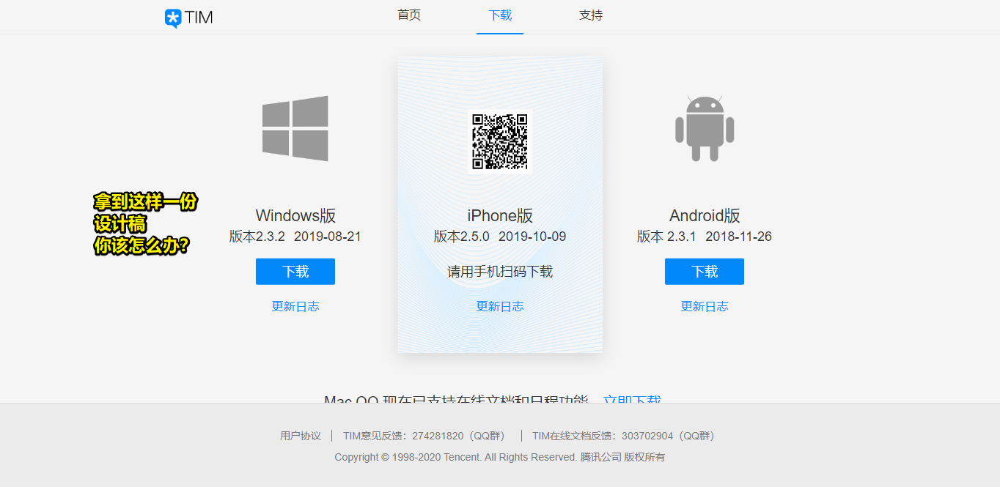
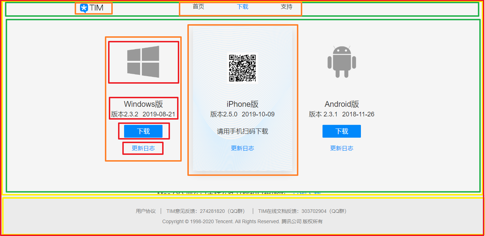
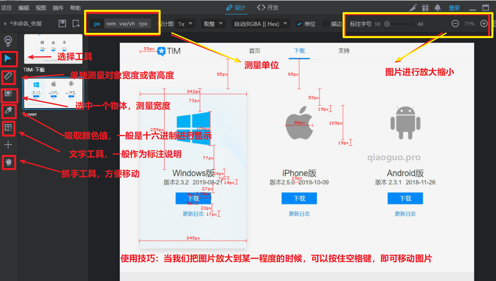
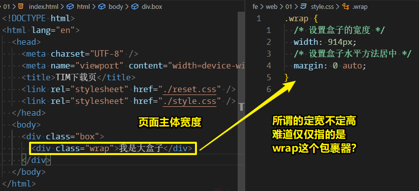
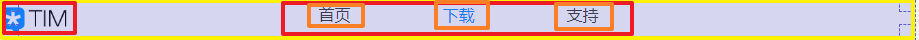

# 01-Web 前端零基础入门到完美项目实战

> 资料：[Web 前端零基础入门到完美项目实战](https://gitbook.cn/gitchat/activity/5e2e8289ac7ad256a46bfb39)

## ★HTML5基础知识

1）HTML？基石？骨架？

HTML 叫做超文本标记语言，是构建网页的基石，如果我们只用HTML去开发我们的网站，那么这样的网站是极其不美观的，如这样：



> 这是我大腿的肌肉： `<大腿>肌肉</大腿>` 

2）我拿到一份设计稿？我要做的第一件事是直接撸代码吗？

> [TIM-下载](https://tim.qq.com/download.html)

拿到这样一份设计稿：



你该怎么办？

对设计图进行区域划分 -> 也就是所谓的「盒子划分」



当然，这盒子的划分，可不是你想咋画就咋画的，一般来说，你得遵循这样规则：

> 从大到小，从左到右

所以也就有了：

红大包裹 -> 上下两黄 -> 择上，又来上下划分 -> 再择上，判断是否还有「上下」，咩有那就从左到右，而这块区域的划分也就到此为止了 -> 同理，其它区域也是如此

然而，我们该如何识别这就是一块东西呢？

> 页面写多了就会划分了 -> 关键思考点「块」、「组」

由此可见：

我们的网页 -> 有许多大大小小的盒子嵌套而成 -> 而这些盒子，我们在实际开发中就可以使用标签元素去描述

如，红大div

> div 标签又称为万能标签，是因为 div 标签可以结合 CSS 去实现任何的 HTML 内置的标签。 -> 万能钥匙 -> 72变，千变万化 -> 你说div能变成canvas、video等这样的标签吗？

3）小结

学习 HTML 并不难，难就难在你需要知道哪些部分应该使用哪一种标签去描述。

如，我大腿的肌肉，应该用 `<大腿>` 描述，还是应该用 `<小手>` 来描述

另一种视角看待元素：别管元素的嵌套情况，只管你看到的信息，一坨独立的信息即为一块元素！这样页面看起来仅仅只是几个元素就能构成了！

还有一种视角：把一个个元素，看做是传输带上的一个个黑箱子，而传输带就是文档流！

> 盒子模型之border-box，符合我们人类生活常识，当然如果一个盒子只有内容，咩有padding和border，那么这也是可以用默认的content-box的！

## ★CSS 基础知识

CSS -> 控制元素在网页上应该如何表现 -> 如这个盒子为啥就得是黄色背景的呢？黄绿色不行吗？ -> 如为啥这**文字**是红色的呢？

1）如何具象化一段 CSS 样式代码？

如这样：

``` html
<div class="xxx">我是黄色的</div>
```

``` css
.xxx {
  color: yellow;
}
```

* `.xxx` 这个元素，是要被控制的对象
* `.xxx {}` 的 `{}` 里边的内容说明我们具体要修改控制对象的什么地方，如它的文本颜色样式

具象化：

老王开了一家理发店，某一天，隔壁的她到老王的店里做头发，那么她就得告知老王说「她这长长的秀发该是搞成卷发的还是直发的」

把**她**看做是「元素」，而把**她的话**看做是「头顶举了个东西」，把**老王**看做是「浏览器」：


2）如何具象化px单位？

px  -> 衡量纸箱子内电子产品的大小 -> 就像是cm可用来衡量个人的高度！

> px并不是绝对单位，它会根据dpr来确定一个px应该多大，说白了，1px是一个点，至于这一个点的大小是多大的，是无法确定的，这得看你的设备哈！

3）选择器

1、作用？

> 选择器的作用主要是帮助我们**精准地控制**到页面中的某个或者某些标签元素

2、种类？

种类很多，但主要分为两部分：

* 基本选择器
  + 标签选择器
  + id选择器
  + class选择器
  + ……
* 高级选择器（组合器）
  + 子元素选择器
  + 伪类选择器
  + ……

3、实际开发中的习惯？

> 在实际开发中，CSS 主要是使用 class 选择器，而要想使用 JS 去控制某个元素标签的行为则一般采用 id 选择器。

4）如何进一步学习HTML、CSS样式属性？

MDN -> 查询标签以及CSS样式属性的具体用法

## ★样式初始化

1）内置标签

HTML内置了很多标签，如：

* p
* ul
* img
* ……

2）为啥会有内置标签？换句话说，它们存在的意义是啥？

简单来说，就是**为了提高开发效率**

关于对「提高开发效率」的形象化理解：

我想吃包子：

* 买现成的
* 自己动手，丰衣足食

话说，这两种方式哪种方式花费的时间比较短？

显然，是**第一种**哈！由于你的需求只是为了吃包子，所以只要能吃到就好了，至于好不吃，就看你能不能**买到好吃的**或者**自己动手做出符合自己口味的**！

言归正传，**div** 可以实现各种标签的效果，但是，它就好像是面粉，**需要花费一些时间才能打造成我们想象中的样子。**

总之，在实际开发中，需要实现什么功能，我们就拿什么标签，如：

* 我想要个无序列表，那就用 `ul>li` 呗
* 我想要个大标题，那就用 `h1` 呗
* 我想要个段落，那就用 `p` 呗
* 我想要个**不知道**，那就用 `div` or `span` 呗
* ……

3）内置标签有浏览器默认给的样式

有些内置标签的默认样式不是很好看 -> 项目开始前去掉它们 -> 如这样：

``` css
 /* 使用通配符选择器，意思是控制所有标签元素的内外边距均为0 */
 * {
   margin: 0;
   padding: 0;
 }

 /* 去掉列表前面的编号样式，如小黑圆点等 */
 ul {
   list-style: none;
 }

 a {
   /* 去掉超链接文字默认的下划线 */
   text-decoration: none;
   /* 设置超链接文字的默认颜色为黑色 */
   color: black;
 }
```

## ★安装测量工具

- div -> 描述这个页面的大盒子
- css -> 描述这个盒子的一些样式，如盒子宽高，效果图中的颜色参数……

1）如何知道盒子有多大？

推荐三种方法

Chrome插件：

- 安装 Page Ruler
- 安装 Page Ruler Redux（UI比第一种好看，不过咩有px单位）

> 能标注一个元素的盒子大小，以及其对应的id、class、还有其父元素和子元素是谁

本地工具：

在实际开发中，用的比较的测量工具是 **PxCook**——对我们的设计图进行标注

测试 -> 截图[TIM](https://tim.qq.com/download.html)下载页（**注：截图时，记得把电脑显示设置中设为 100%（`Ctrl+0`），唯有这样，在 PxCook 里边测量出来的数据才会准确**）

官网：[PxCook - 高效易用的自动标注工具,生成前端代码,设计研发协作利器](https://www.fancynode.com.cn/pxcook)

> windows直接下载，而Mac系统则需要先安装Sketch插件后再下载！

2）PxCook用法？

1. PxCook安装完成后新建一个本地项目
2. 双击项目进去直接使用

简单介绍一下 PxCook 的一些功能：



## ★制作顶部大盒子

网页分析 -> 网页最外边有个大盒子将这个网页包裹起来 -> 给最外面的盒子 class 属性，用于区分

顶部盒子 -> class 属性为 wrap  -> 用于区分 -> 设置样式

> 注：在实际开发的过程中，我们一般遵循**定宽不定高**的规则，因此，我们在设置大盒子的时候，不要给这个盒子规定高度 -> 难道不是**不定宽不定高**原则吗？又或者说**这是PC页面**，就不需要做？又或者说**具体情况具体分析**？

demo：



这个914px是使用工具测量出来的！

## ★顶部导航栏制作

制作顶部导航栏 -> 水平方向上，主要包含两部分 -> logo & 导航栏

1）分析应该用哪些标签来描述内容



- 最外面大盒子（用div来描述）
  - 左边盒子（div）
    - 左边图片（img）
    - 文字（span）
  - 右边盒子（有三项内容，但内容结构相同 -> `ul>li` -> 鼠标hover到每一项鼠标会变成抓手状态 -> 内容是链接 -> `a`包裹文字内容）

2）logo怎么做？

➹：[网站的 logo 图片用 img 标签还是背景图片合适? - 知乎](https://www.zhihu.com/question/20990026)

1、TPR

**①tabindex、acesskey？**

- tabindex： 全局属性 指示其元素是否可以聚焦（`tab`键），如 `-1`值，表示元素是可聚焦的，但是不能通过键盘导航来访问到该元素；如 `0`值（默认值），可聚焦，可用键盘访问，顺序交给DOM结构来决定；如正值，假如x元素是3，y元素是4，z元素是5，那么你按tab键，会先让3聚焦，不过一般不建议用大于0的数值，因为这对那些依靠辅具来浏览和操作页面内容的人来说是很不友好的，总之，还是交给DOM结构顺序吧！
- acesskey：在HTML5规范，`accesskey`属性可以作用在任意的元素上，变成了“全局属性”。作用可以让浏览器支持我们自定义的快捷访问方式，如：[accesskey属性实用性增强accesskey.js使用示意](https://www.zhangxinxu.com/study/201705/accesskey-js-enhance.html)

➹：[tabindex - HTML: Hypertext Markup Language - MDN](https://developer.mozilla.org/en-US/docs/Web/HTML/Global_attributes/tabindex)

➹：[HTML accesskey属性与web自定义键盘快捷访问 « 张鑫旭-鑫空间-鑫生活](https://www.zhangxinxu.com/wordpress/2017/05/html-accesskey/)

**②CSS裸奔？**

CSS Naked Day，也称CSS裸奔节或CSS裸奔日，就是脱掉网站页面的CSS，通过这个节日来提醒选用合适HTML标签的重要性，一般是每年的4月9日，不过自打2013年举办之后，就咩有再举办过了！

➹：[2018 CSS裸奔节](https://www.cssforest.org/2018/04/09/2018-CSS%E8%A3%B8%E5%A5%94%E8%8A%82.html)

➹：[CSS裸奔日 - Windie Chai - 博客园](https://www.cnblogs.com/xiaoshatian/archive/2009/04/09/1432658.html)


